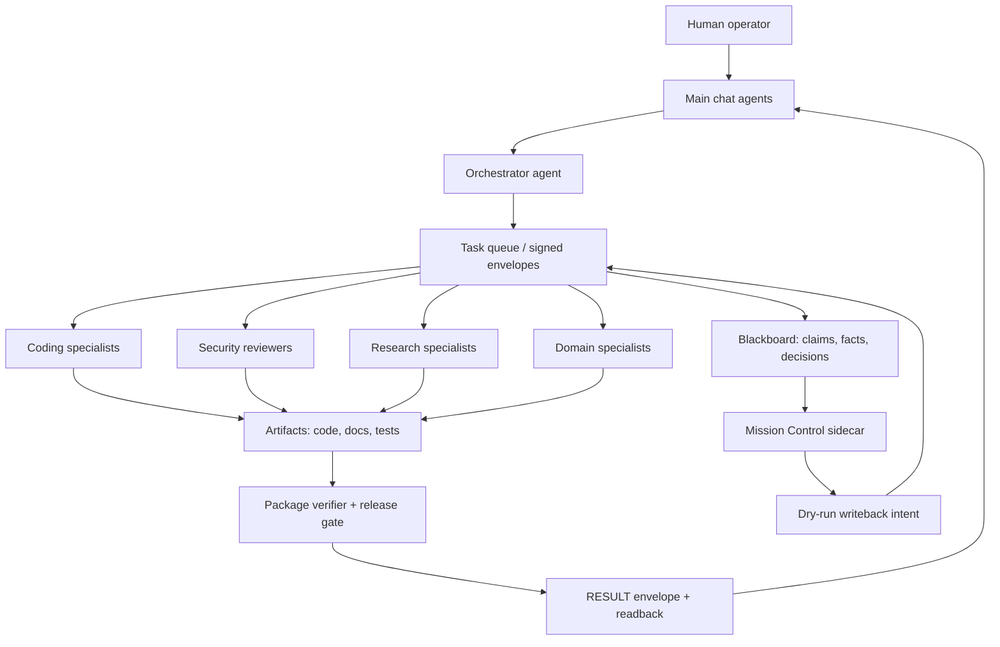
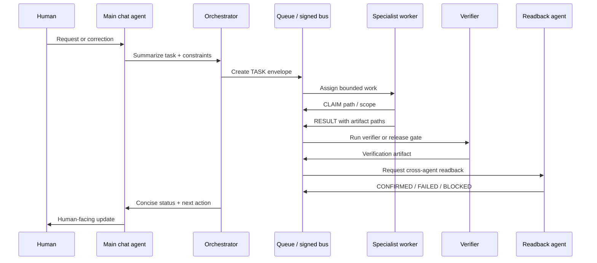
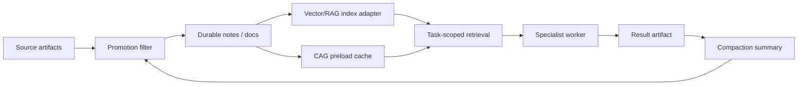

# Architecture diagrams

These diagrams are production-safe conceptual maps for OpenClaw Frontier Stack. They use synthetic component names only and avoid private hostnames, paths, IPs, credentials, raw logs, and personal context.

## Full-stack overview



## Request-to-result flow



## Memory/RAG/CAG/compaction flow



## Release gate flow

```mermaid
flowchart TB
  Candidate[Clean package candidate] --> Verify[Package verifier]
  Verify --> Scan[Private-content scan]
  Scan --> Reviewers[4/4 reviewer decisions]
  Reviewers --> Decision{All approve?}
  Decision -- no --> Block[BLOCK with reasons]
  Decision -- yes --> the operator[the operator explicit approval]
  the operator --> Publish[External publish step]
  Block --> Fix[Fix artifacts]
  Fix --> Candidate
```

## Diagram status

- Full-stack overview: ready for README or docs.
- Request-to-result flow: captures delegate-first queue pattern.
- Memory flow: conceptual until real RAG/CAG adapters are packaged.
- Release gate flow: conceptual until 4/4 decision artifacts exist.
